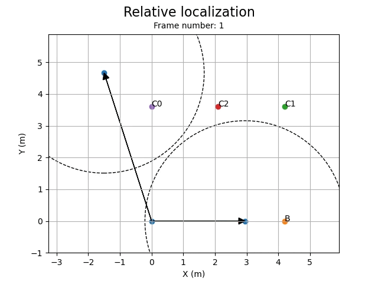

<a name="readme-top"></a>
<!--
*** Template from https://github.com/othneildrew/Best-README-Template
***
*** LICENSE FROM https://github.com/othneildrew/Best-README-Template:
***
*** MIT License
***
*** Copyright (c) 2021 Othneil Drew
***
*** Permission is hereby granted, free of charge, to any person obtaining a copy
*** of this software and associated documentation files (the "Software"), to deal
*** in the Software without restriction, including without limitation the rights
*** to use, copy, modify, merge, publish, distribute, sublicense, and/or sell
*** copies of the Software, and to permit persons to whom the Software is
*** furnished to do so, subject to the following conditions:
***
*** The above copyright notice and this permission notice shall be included in all
*** copies or substantial portions of the Software.
-->


<!-- PROJECT SHIELDS -->
<!--
*** I'm using markdown "reference style" links for readability.
*** Reference links are enclosed in brackets [ ] instead of parentheses ( ).
*** See the bottom of this document for the declaration of the reference variables
*** for contributors-url, forks-url, etc. This is an optional, concise syntax you may use.
*** https://www.markdownguide.org/basic-syntax/#reference-style-links
-->
[![Contributors][contributors-shield]][contributors-url]
[![Stargazers][stars-shield]][stars-url]
[![Issues][issues-shield]][issues-url]
[![License][license-shield]][license-url]
[![Project Page][project-shield]][project-url]


<!-- PROJECT LOGO -->
<br />
<div align="center">
  <a href="https://github.com/Swarm-Systems-Lab/Distributed_localization_DWM1001">
    
  </a>

<h3 align="center">Distributed algorithm platform for the DWM1001-DEV</h3>

  <p align="center">
    Platform for developing distributed algorithms in the DWM1001-DEV board
    <br />
    <a href="https://github.com/Swarm-Systems-Lab/Distributed_localization_DWM1001"><strong>Explore the docs »</strong></a>
    <br />
  </p>
</div>


<!-- TABLE OF CONTENTS -->
<details>
  <summary>Table of Contents</summary>
  <ol>
    <li>
      <a href="#about-the-project">About The Project</a>
      <ul>
	  	<li><a href="#usage-examples">Use cases</a></li>
        <li><a href="#built-with">Built With</a></li>
      </ul>
    </li>
    <li><a href="#prerequisites">Prerequisites</a></li>
    <li><a href="#installation">Installation</a></li>
    <li><a href="#contributing">Contributing</a></li>
    <li><a href="#license">License</a></li>
    <li><a href="#contact">Contact</a></li>
  </ol>
</details>


<!-- ABOUT THE PROJECT -->
## About The Project

This project aims to develop a platform for **distributed algorithms** on the DWM1001C device, using a free and open source RTOS provided by **ChibiOS**. The DWM1001C includes a microcontroller and a transceptor to allow for wireless communication, we provide an interface between the hardware and a higher level API to implement distributed applications on real devices using **Ultra-Wideband** communications.

The project architecture is **layered**, providing different levels of abstraction for the different needs any application may have.

1. #### Hardware abstraction (Configure data rate, channel, timeout..) (Cross-platform)
2. #### Device Driver and peripherals (Drivers for DW1000, UART... on ChibiOS)
3. #### Communication and networking (API for sending, receiving, broadcasting...)
4. #### Application (Any application you wish to implement)
\
\
The application layer can benefit from a complete API in which sending a message to a device or receiving data is as easy as calling a function.
\
\
This project is a **WIP** so much of the functionality is still in development, any [contributions](#contributing) or suggestions are welcome.
\
\
[Documentation](https://github.com/Swarm-Systems-Lab/Distributed_localization_DWM1001/tree/main/docs) WIP

<!-- USAGE EXAMPLES -->
## Usage examples

Many distributed algorithms that rely on wireless communication between separate devices could be implemented using this platform, here are some examples we have begun working on and testing:

### Distributed localization for robot swarms



_Distributed localization in a plane with 3 devices_

This application provides **relative positioning** information regarding the neighbours of each node on a distributed network, **without relying on any external infrastruture**. Using a Two-Way Ranging scheme distances between all neighbouring devices are obtained in a distributed fashion and, from these distances, relative position can be derived using trilateration.

### Consensus protocols

Many consensus algorithms such as **averaging** between devices require frequent information exchange, our platform provides an implementation opportunity to test and run these algorithms.


_Centroid estimation consensus algorithm, EXECUTED ON SIMULATION [Source](https://github.com/jesusBV20/source_seeking_distr/tree/master)_

This centroid estimation, can be implemented on real hardware using the communication API and creating an application which implements the algorithm's calculations and information exchange between devices.

## Anything you can think of

Using this platform a huge number of distributed algorithms can be implemented such as **clock synchronization**...

### Built With

* [![ChibiOS][ChibiOS]][ChibiOS-url]
* [![ChibiOS-Contrib][Contrib]][ChibiOS-url]
* [![Jlink][Jlink]][Jlink-url]
* [![OpenOCD][OpenOCD]][OpenOCD-url]
* [![GDB][GDB]][GDB-url]

<!-- GETTING STARTED -->
### Prerequisites

Prerequites are mostly inherited from ChibiOS and related to the architecture of the board, OS for development and debugging should be GNU/Linux or al least a POSIX compliant shell and GNU utilities

* **arm-none-eabi toolchain**
  
  GNU Embedded toolchain used to compile, link and debug code for embedded devices.

* **OpenOCD**
  
  Used to connect to the board and flash or debug the code. [OpenOCD](https://openocd.org/)

* **Jlink**
  
  Download from the official site, [Segger](https://www.segger.com/downloads/jlink/).
  
  For Linux, if the tar package is chosen, the path of the installation should be appended to system **PATH** variable.


### Building

1. Clone the project repository ```git clone https://github.com/Swarm-Systems-Lab/Distributed_localization_DWM1001.git```
2. Prepare submodules
	- Initialize the submodules with ```git submodule init```
    - Sync with remote ```git submodule sync```
	- Download submodules ```git submodule update --recursive --remote```
3. Run ```make all``` to build all binaries.

### Flashing

1. Plug the board through USB and make sure it is detected as a device through lsusb.
2. Run ```make flash``` to flash with J-link or ```make openocd-flash```

### Debugging

1. Start the GDB server with ```make openocd-debug-server```
2. Open a GDB session with ```make openocd-debug```

A GBD server or session is created for each DWM1001-DEV board connected

If you use VSCode you can install the [Cortex-Debug](https://github.com/Marus/cortex-debug) extension to debug from the GUI.


_DWM1001-DEV development board_

<!-- CONTRIBUTING -->
## Contributing

1. Fork the Project
2. Create your Feature Branch (`git checkout -b feature/AmazingFeature`)
3. Commit your Changes (`git commit -m 'Add some AmazingFeature'`)
4. Push to the Branch (`git push origin feature/AmazingFeature`)
5. Open a Pull Request

Please contact the project maintainers to contribute, we are open to any ideas, improvements or features :D.

<!-- LICENSE -->
## License

Distributed under the GNU General Public License v2.0. See `LICENSE` for more information.

<!-- CONTACT -->
## Contact

Swarm Systems Lab - swarmsystemslab@gmail.com

Project Link: [https://github.com/Swarm-Systems-Lab/Distributed_localization_DWM1001](https://github.com/Swarm-Systems-Lab/Distributed_localization_DWM1001)

<p align="right">(<a href="#readme-top">back to top</a>)</p>


<!-- MARKDOWN LINKS & IMAGES -->
<!-- https://www.markdownguide.org/basic-syntax/#reference-style-links -->
[contributors-shield]: https://img.shields.io/github/contributors/Swarm-Systems-Lab/Distributed_localization_DWM1001.svg?style=for-the-badge
[contributors-url]: https://github.com/Swarm-Systems-Lab/Distributed_localization_DWM1001/graphs/contributors
[stars-shield]: https://img.shields.io/github/stars/Swarm-Systems-Lab/Distributed_localization_DWM1001.svg?style=for-the-badge
[stars-url]: https://github.com/Swarm-Systems-Lab/Distributed_localization_DWM1001/stargazers
[issues-shield]: https://img.shields.io/github/issues/Swarm-Systems-Lab/Distributed_localization_DWM1001.svg?style=for-the-badge
[issues-url]: https://github.com/Swarm-Systems-Lab/Distributed_localization_DWM1001/issues
[license-shield]: https://img.shields.io/github/license/Swarm-Systems-Lab/Distributed_localization_DWM1001.svg?style=for-the-badge
[license-url]: https://github.com/Swarm-Systems-Lab/Distributed_localization_DWM1001/blob/master/LICENSE.txt
[project-shield]: https://img.shields.io/badge/Swarm_System_Labs-blue
[project-url]: https://sites.google.com/view/hgdemarina
[ChibiOS]: https://img.shields.io/badge/ChibiOS-blue
[ChibiOS-url]: https://github.com/ChibiOS/ChibiOS/tree/stable_21.11.x
[Contrib]: https://img.shields.io/badge/ChibiOS_Contrib-blue
[Contrib-url]: https://github.com/Swarm-Systems-Lab/ChibiOS-Contrib/tree/chibios-21.11.x
[Jlink]: https://img.shields.io/badge/Jlink-blue
[Jlink-url]: https://www.segger.com/downloads/jlink/
[OpenOCD]: https://img.shields.io/badge/OpenOCD-blue
[OpenOCD-url]: https://openocd.org/
[GDB]: https://img.shields.io/badge/GDB-blue
[GDB-url]: https://www.sourceware.org/gdb/
[Decawave]: https://img.shields.io/badge/DWM1001_Examples-blue
[Decawave-url]: https://github.com/Decawave/dwm1001-examples